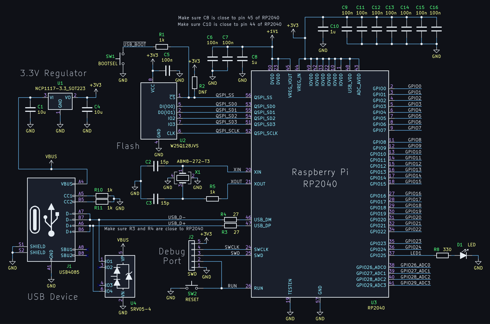
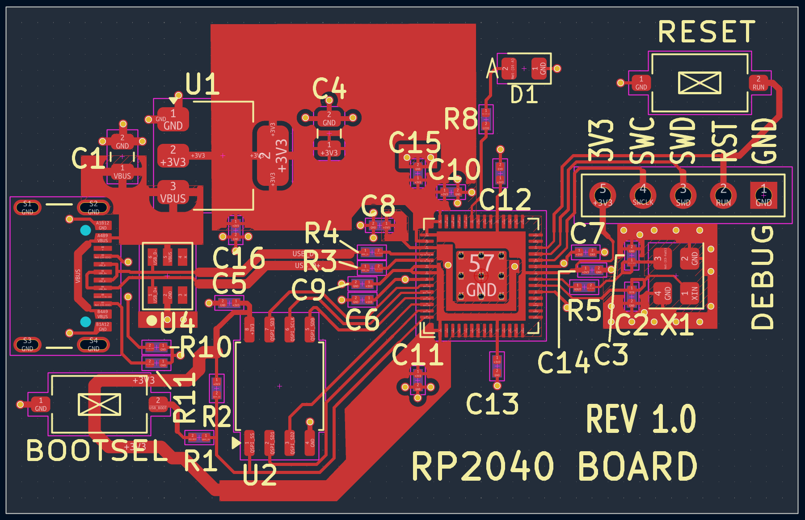
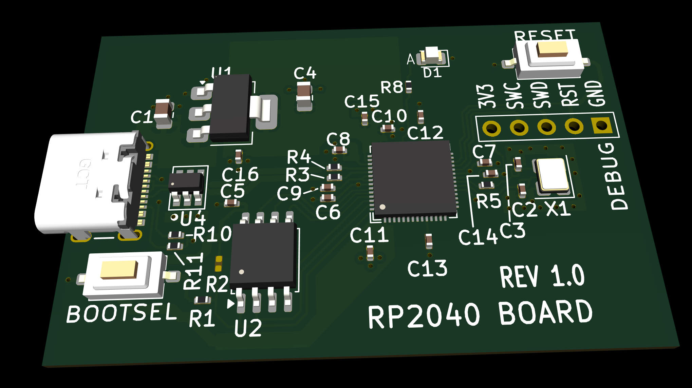

# RP2040 Minimal Project for KiCad

This repository contains a modified version of the Raspberry Pi RP2040 Minimal design.

The modified version is more suited to recent KiCad versions (for instance KiCad 10), and it improves things slightly if the board is to be produced, for fewer 0402 parts rotating/sliding/tombstoning issues.

## Schematic

The schematic includes the RP2040 microcontroller along with supporting circuitry. The USB connector is USB-C, unlike the original Micro USB. The GPIO connectors from the original schematic have been removed, so that the schematic is ready for custom additions. 

## PCB Layout

The image here shows the top side copper. The bottom side is nearly all ground plane, apart from a few traces that carry 1.1V core power, and a few traces at the USB-C connector end to allow cables to be inserted in any orientation.

## 3D Render

